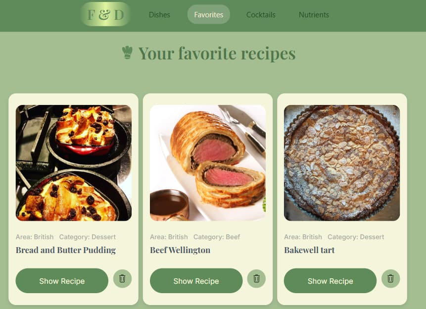
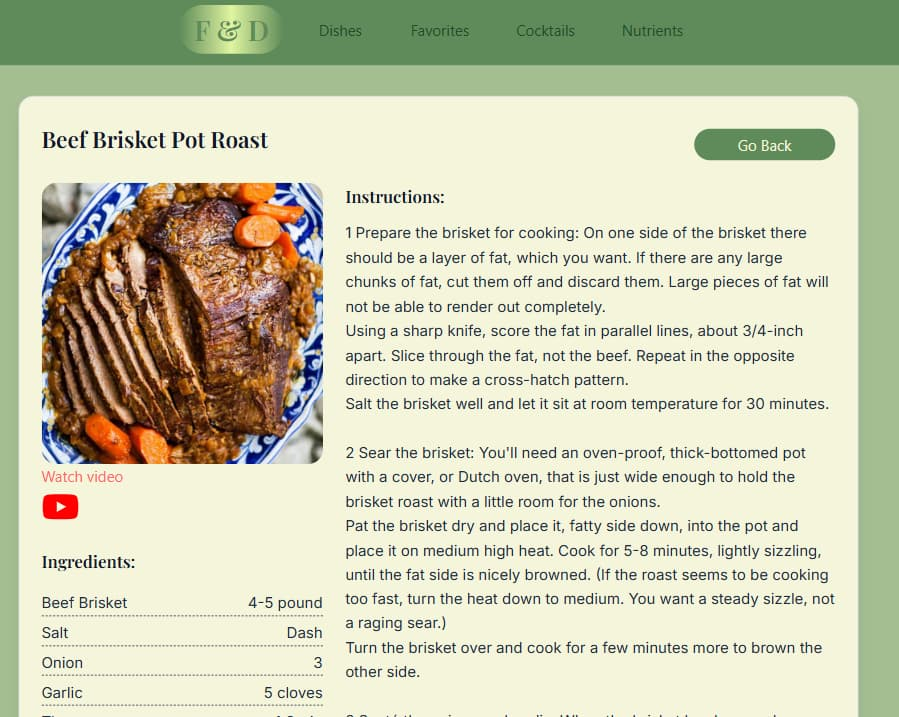
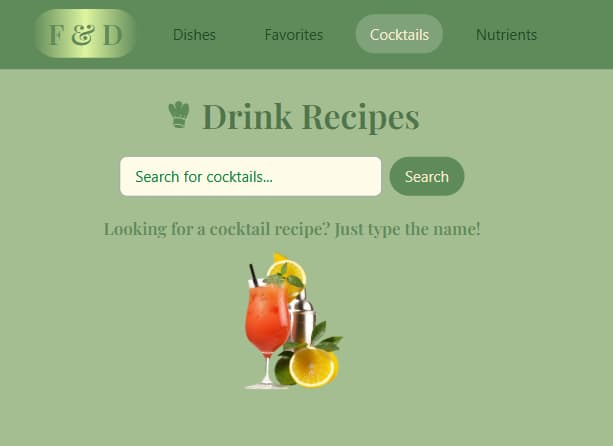
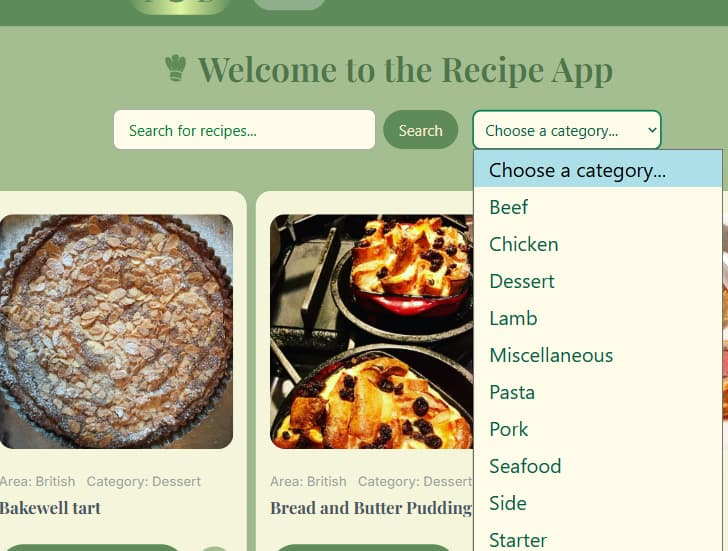

# React + TypeScript + Vite

# 🧑‍🍳 _`Food & Drinks`_ — Your Personal Cookbook

`Food & Drinks` is a stylish and intuitive web app for anyone passionate about tasty meals and refreshing drinks. Whether you're seeking inspiration for dinner or curious about nutrient content — this app makes recipe discovery both fun and informative.

## ✨ What You Can Do

- 🔍 _Search recipes for meals and drinks_
- 🧠 _Explore nutrient content for each dishe_
- ❤️ _Save your favorite recipes_
- 🎥 _Watch preparation videos via YouTube (where available\*)_
- 📱 _Enjoy fast navigation and responsive design_

---

## 🌿 Gallery Preview

<div style="display: flex; flex-wrap: wrap; gap: 15px;">
  
  
  
  
  
  
  
  
</div>

---

## 🧭 App Structure

| Main Pages | Feature Pages  |
| ---------- | -------------- |
| Main       | Favorites      |
| Dishes     | Nutrients      |
| Drinks     | Recipe Details |

---

## ⚙️ Technologies Used

This app is built with a modern frontend stack for optimal performance and maintainability:

- **React + Vite** - fast and modular setup
- **Redux Toolkit** - state management
- **TypeScript** — type-safe and scalable code
- **Tailwind CSS v4.1** - utility-first styling
- **Axios** - for API integration
- **React Router** - for smooth navigation
- **clsx** — elegant conditional styling
- **LocalStorage** - saving favorites directly in the browser
- **React-countup** - styles active users
- **React Icons** - icon styling

```js
export default tseslint.config([
  globalIgnores(["dist"]),
  {
    files: ["**/*.{ts,tsx}"],
    extends: [
      // Other configs...

      // Remove tseslint.configs.recommended and replace with this
      ...tseslint.configs.recommendedTypeChecked,
      // Alternatively, use this for stricter rules
      ...tseslint.configs.strictTypeChecked,
      // Optionally, add this for stylistic rules
      ...tseslint.configs.stylisticTypeChecked,

      // Other configs...
    ],
    languageOptions: {
      parserOptions: {
        project: ["./tsconfig.node.json", "./tsconfig.app.json"],
        tsconfigRootDir: import.meta.dirname,
      },
      // other options...
    },
  },
]);
```

You can also install [eslint-plugin-react-x](https://github.com/Rel1cx/eslint-react/tree/main/packages/plugins/eslint-plugin-react-x) and [eslint-plugin-react-dom](https://github.com/Rel1cx/eslint-react/tree/main/packages/plugins/eslint-plugin-react-dom) for React-specific lint rules:

```js
// eslint.config.js
import reactX from "eslint-plugin-react-x";
import reactDom from "eslint-plugin-react-dom";

export default tseslint.config([
  globalIgnores(["dist"]),
  {
    files: ["**/*.{ts,tsx}"],
    extends: [
      // Other configs...
      // Enable lint rules for React
      reactX.configs["recommended-typescript"],
      // Enable lint rules for React DOM
      reactDom.configs.recommended,
    ],
    languageOptions: {
      parserOptions: {
        project: ["./tsconfig.node.json", "./tsconfig.app.json"],
        tsconfigRootDir: import.meta.dirname,
      },
      // other options...
    },
  },
]);
```
